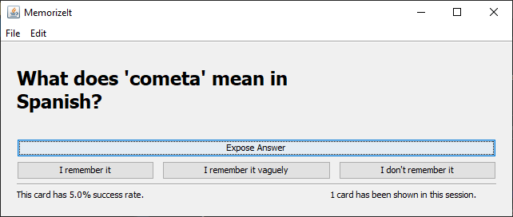
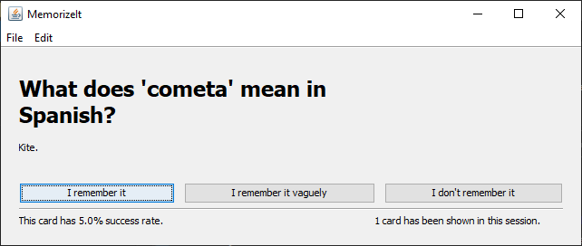
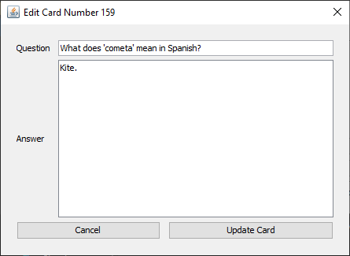
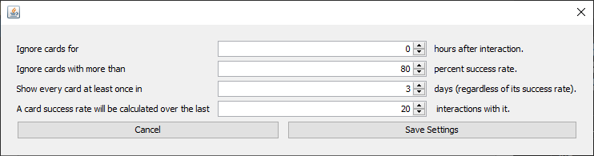

# MemorizeIt

MemorizeIt is a simple cross-platform open-source Java application, that helps memorizing facts using flash-cards. It is fully customizable and can be adapted for various goals, such as learning a new language, studying to a test and so on.

## Features

* **Dynamic sessions.** Show cards with lower success rate more often, to provide a fast and focused study process. Show cards you have not interacted with recently before other cards.
* **Filtering options.** Hide cards whose success rate is higher than a specified threshold, unless you have not interacted with them for a long time.
* **Snooze.** Choose a period of time to hide cards after you interacted with them.
* **Add, edit and remove cards easily.**
* **Supports cards import / export.** Backup your cards and load a set of new cards from a pre-prepared csv file in seconds.
* Reset the interactions history anytime to start fresh.
* Remove interaction records in a given range of dates, if necessary.
* Clear the current card set in seconds to load or create a different one.
* Lightweight and fast.
* Simple interface.
* No internet connection required.
* No trackers.
* No ads.

### Screenshots

### Requirements

* Java Runtime Environment (JRE)

### Dependencies

* `sqlite-jdbc-3.36.0.1`
* `com.opencsv:opencsv:5.5.1`

